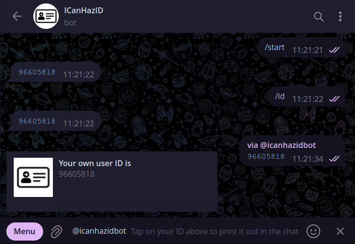

# cf-workers-icanhazid-telegram-bot


## Description


Inspired by https://icanhazip.com/ (which is also [hosted on Cloudflare Workers](https://major.io/2021/06/06/a-new-future-for-icanhazip/)), this bot simply replies the current chat's ID for info when started or invited to the chat.

You can get your own user ID by just typing `@icanhazidbot` and a space in any chat, then tapping your ID to print it out in the active chat. Alternatively, you can talk to the bot directly.

If you need the ID of a group chat, you should invite the bot @ http://t.me/icanhazidbot to the group and it would immediately print out the ID in the group chat.

## Commands
```
id - Get the bot to respond with the ID of the current chat
```

## Deployment
### Workers
1. Clone this repository
2. Run `npm ci` or `yarn install`
3. Run `npx wrangler secret put TELEGRAM_BOT_TOKEN` and set the Telegram bot token
4. Run `npx wrangler publish` to deploy to Cloudflare Workers
5. Replace `{TELEGRAM_BOT_TOKEN}` and `{WORKERS_NAMESPACE}` on the following `https://api.telegram.org/bot{TELEGRAM_BOT_TOKEN}/setWebhook?allowed_updates=%5B%22message%22%2C%22inline_query%22%5D&url=https%3A%2F%2Fcf-workers-icanhazid-telegram-bot.{WORKERS_NAMESPACE}.workers.dev%2F{TELEGRAM_BOT_TOKEN}` and access it on your browser
